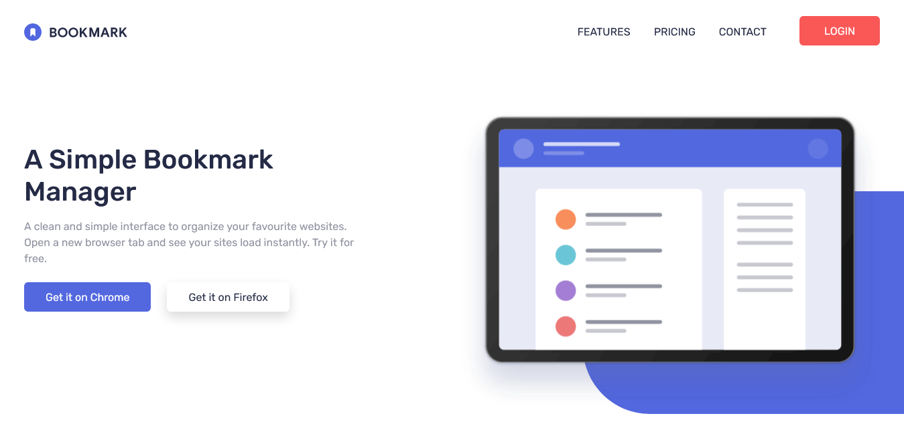

# Frontend Mentor - Bookmark landing page solution

This is a solution to the [Bookmark landing page challenge on Frontend Mentor](https://www.frontendmentor.io/challenges/bookmark-landing-page-5d0b588a9edda32581d29158). Frontend Mentor challenges help you improve your coding skills by building realistic projects. 

## Table of contents

- [Overview](#overview)
  - [The challenge](#the-challenge)
  - [Screenshot](#screenshot)
  - [Links](#links)
- [My process](#my-process)
  - [Built with](#built-with)
  - [What I learned](#what-i-learned)
  - [Useful resources](#useful-resources)
- [Author](#author)

## Overview

### The challenge

Users should be able to:

- View the optimal layout for the site depending on their device's screen size
- See hover states for all interactive elements on the page
- Receive an error message when the newsletter form is submitted if:
  - The input field is empty
  - The email address is not formatted correctly

### Screenshot

### Links

- [Live site](https://romario-negreiros.github.io/Bookmark/)

## My process

### Built with

- Semantic HTML5 markup
- Bootstrap
- Mobile-first workflow

### What I learned

- How to use bootstrap to ease the layout construction and page's styling

### Useful resources

- [Bootstrap 5.2 Docs](https://getbootstrap.com/docs/5.2/getting-started/introduction/)

## Author

- Website - [Romario Negreiros](https://romario-negreiros.github.io/Romario-frontend/)
- Frontend Mentor - [@Romario-Negreiros](https://www.frontendmentor.io/profile/Romario-Negreiros)
- Github profile - [Romario-Negreiros](https://github.com/Romario-Negreiros)
- Linkedin profile - [Romario Negreiros](https://www.linkedin.com/in/romario-negreiros-8591b6214/)
